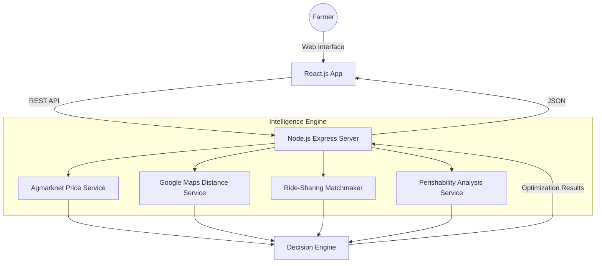

# 🌾 Krishi Route - Profit & Logistics Optimizer (Deployment and Live Link)

**"Google Maps for Farmers, optimized for PROFIT"**

Krishi Route is a professional, full-stack decision-support platform built to empower Indian farmers. By integrating real-time market prices, road logistics, and proprietary economic models, it helps farmers move from "Which market is closest?" to "Which market returns the highest net profit?"

---

##  ️ Technical Architecture

Krishi Route uses a decoupled 3-tier architecture designed for scalability and real-time processing:



---

## ✨ Features Breakdown

### 🛠️ Core Capabilities
- **Real-Time Mandi Prices**: Integration with **Agmarknet API** to get the latest prices across Indian markets.
- **Precision Logistics**: Road distances calculated via **Google Maps Matrix API**, factoring in actual travel routes.
- **Cost Transparency**: Automatic calculation of transport, handling, and commission costs based on load quantity and vehicle type.

### 🚀 Advanced Features (New)
- **🤝 Advanced Ride-Sharing (Pooling)**: Finds nearby farmers heading to the same destination. 
  - **Weighted Cost Splitting**: Splits fuel/transport costs proportionally by crop weight, maximizing savings.
  - **Matchmaking Service**: Automatically pairs users with active "pool opportunities."
- **  Perishability Algorithm**: Proprietary logic that calculates **Spoilage Risk** for high-perishability crops (onions, tomatoes).
  - Adjusts net profit based on travel time and crop shelf life.
  - Provides "Local Alternative" warnings if the risk is too high.
- **📈 Market Intelligence (Advanced)**: 
  - **Price Volatility Alerts**: Detects sudden price drops or spikes based on 3-day history to warn farmers.
  - **Historical Trend Insights**: Predictive analysis of peak selling days (e.g., "Mandi usually peaks on Mondays").
- **🇮🇳 Full Localization**: Native support for **9 languages** (Hindi, Marathi, Punjabi, Gujarati, Tamil, Telugu, Kannada, Bengali, and English).
- **🗺️ Map Intelligence**: Dynamic markers switch between English (CartoDB) and Localized (Google) tiles for native readability.

---

##   Setup & Installation (Detailed)

There are two ways to run this project: **Separate Setup** (Recommended for debugging) or **Unified Setup** (Fastest).

### Option 1: Separate Backend & Frontend (Step-by-Step)

#### 1. Backend Setup
1. Open a terminal and navigate to the backend folder:
   ```bash
   cd backend
   ```
2. Install dependencies:
   ```bash
   npm install
   ```
3. Configure your environment:
   Create a `.env` file in the `backend/` folder (Copy from `backend/.env.example` if available):
   ```bash
   PORT=5000
   MONGODB_URI=your_mongodb_uri
   GOOGLE_MAPS_API_KEY=your_key
   AGMARKNET_API_KEY=your_key
   USE_MOCK_DATA=false
   ```
4. Run the backend:
   ```bash
   
   npm start
   ```
   *The server will start on `http://localhost:5000`*

#### 2. Frontend Setup
1. Open a **new terminal** and navigate to the frontend folder:
   ```bash
   cd frontend
   ```
2. Install dependencies:
   ```bash
   npm install
   ```
3. Run the development server:
   ```bash
   npm start
   ```
   *The app will open on `http://localhost:3000`*

---

### Option 2: Unified Setup (Monorepo)

*Note: Requires `npm install` at the root to enable `concurrently`.*

1. **Install everything**:
   ```bash
   npm run install-all
   ```
2. **Setup Env**: Follow the backend env setup above.
3. **Run Both**:
   ```bash
   npm run dev
   ```

---

### Option 3: Dockerized Setup (Recommended for Deployment)

Krishi Route is fully containerized for easy deployment and local testing.

1. **Install Docker and Docker Compose**.
2. **Setup Environment Variables**:
   Update `backend/.env` with your API keys.
3. **Build and Start**:
   ```bash
   npm run docker:build
   npm run docker:up
   ```
   - **Frontend**: `http://localhost:3000`
   - **Backend**: `http://localhost:5000`
   - **MongoDB**: `mongodb://localhost:27017`

### Option 4: Easy Vercel Deployment

This project is optimized for one-click deployment to Vercel.

1. **Push to GitHub/GitLab/Bitbucket**.
2. **Connect your repository to Vercel**.
3. **Environment Variables**: Add your API keys (Google Maps, Agmarknet, MongoDB) in the Vercel dashboard.
4. **Deploy**: Vercel will automatically detect the root `vercel.json` and build the monorepo architecture correctly.

---

## 🛠️ Health & Monitoring

- **Health Check**: The backend includes a health monitoring endpoint at `/api/health`.
  - **URL**: `http://localhost:5000/api/health`
  - **Response**: `{ "status": "UP", "timestamp": "...", "uptime": "...", "environment": "..." }`

## 🛠️ Troubleshooting

- **'concurrently' is not recognized**: This occurs if you run `npm run dev` before installing root dependencies. Run `npm install` in the root folder first.
- **Coordinates out of range**: Ensure your GPS location is within standard lat/long ranges or use a mock location.

---

- **Project Demo Video**: https://drive.google.com/file/d/1SBiKJHwO4grpoJi7aVIosyl5A5VBvLKe/view?usp=drivesdk

---

## ☁️ Deployment & Live Links

- **Deployment Link(Live Links)**: https://krishirout.vercel.app/
- **Frontend Hosting**: Deployed on **Vercel** via the root `vercel.json`.
- **Backend Hosting**: Hosted on **Render** (Node.js/Express).
- **API URL**: In production, the frontend is configured to use the Render-hosted `/api` URL.

---

## 📄 License
MIT License - Developed for the advancement of Indian Agricultural Logistics.

